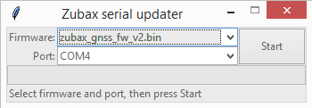

# Zubax Serial Updater

Simple cross-platform GUI application to update MCU firmware via serial port.



Put the binaries into the current directory, making sure that their extension is `.bin`.
When started, the application will pick all available `*.bin` files from its local directory/package,
making them available for choice from a drop-down list.

When the application is built into a Windows `.msi` package, the binaries from the current directory will be packaged together with the application, creating a nice single-file medium for firmware distribution.

## Linux

Python dependencies:

* Python 3.x (recommended) or 2.7
* `serial`
* `tkinter`

The application should be used as-is, no installation is required.

### Installing dependencies on Ubuntu

Python 3.x (preferred):

```bash
sudo apt-get install python3-serial python3-tk
```

Python 2.7 (not recommended):

```bash
sudo apt-get install python-serial python-tk
```

## Windows

Build-time Python dependencies:

* Python 3.x (download from <https://python.org>)
* `serial` (installation command: `pip install pyserial`)
* `tkinter` (typically it is already included with Python package for Windows, so no installation is necessary)
* `cx_Freeze` (installation command: `pip install cx_Freeze`)

Build instructions:

* Put the binary into this directory, its extension must be `.bin`
* Execute `python setup.py bdist_msi`
* Collect the resulting `.msi` archive
